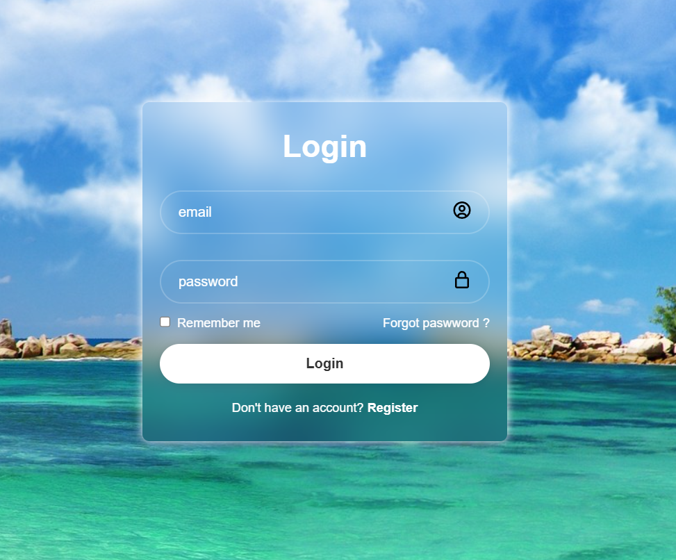

# Login Page

Une page de connexion moderne et élégante, réalisée en HTML et CSS.

## Description
Ce mini projet web permet d’afficher une interface de connexion stylée avec :
- un champ email,
- un champ mot de passe,
- un bouton de connexion,
- un rendu visuel soigné et responsive.

## Aperçu
Ouvrez le fichier `index.html` dans votre navigateur pour visualiser la page.

## Technologies utilisées
- HTML
- CSS

## Objectif
Créer une interface de connexion simple, propre et visuellement agréable pour un projet web de base.

### Aperçu de l’interface

