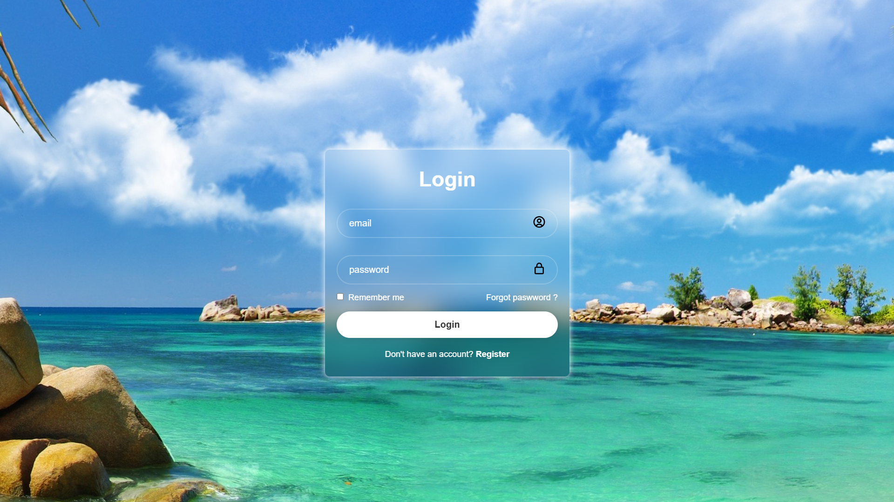

# Login Page

Une page de connexion moderne et élégante réalisée en **HTML, CSS et JavaScript**.

## 📋 Description

Ce projet est une **interface de connexion complète et fonctionnelle**, prête à être utilisée ou intégrée dans n'importe quel projet web. Il propose :

- Champ email avec validation
- Champ mot de passe sécurisé
- Validation dynamique côté client avec JavaScript
- Option "Remember me" pour la persistence
- Lien "Forgot password" et "Register"
- Design moderne, épuré et responsive
- Rendu visuel soigné sur tous les appareils

## 🚀 Démarrage rapide

Ouvrez simplement le fichier `index.html` dans votre navigateur pour visualiser et tester la page.

## 🎨 Aperçu

## 🛠️ Technologies utilisées

- **HTML5** : structure sémantique et formulaires
- **CSS3** : design moderne, animations et responsive design
- **JavaScript (Vanilla)** : validation des formulaires et interactions utilisateur

## ✅ Statut

Ce projet est **terminé et prêt à l'emploi**. C'est une page standalone complète qui peut être utilisée comme base ou intégrée dans d'autres projets.

**Note** : Le formulaire est actuellement configuré pour envoyer les données à `login.php`. Pour une authentification réelle en production, vous devrez configurer votre backend approprié.
